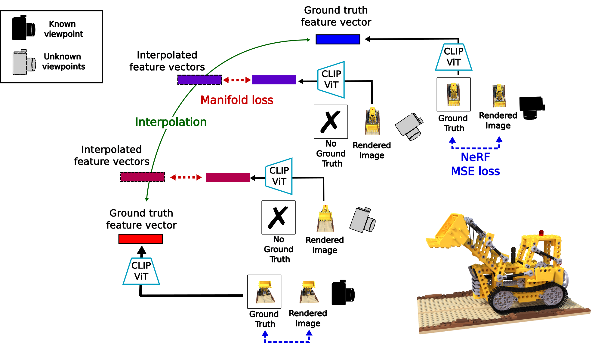

# ManifoldNeRF  
This is an official repository of the ManifoldNeRF accepted BMVC2023.　　
\[[arxiv]()\]



# Environment
- Python 3.8.20
- CUDA 12.4

# Setup

## Prerequisites
- Python 3.8.20
- CUDA 12.4

## Installation Steps

1. **Make conda environment**
    ```bash
    conda create -n manifoldnerf python=3.8.20
    conda activate manifoldnerf
    ```

2. **Install PyTorch**
   ```bash
   pip install torch==2.4.1 torchvision==0.19.1 torchaudio==2.4.1 --index-url https://download.pytorch.org/whl/cu124
   ```

3. **Install CLIP (Editable Mode)**
   ```bash
   cd CLIP
   pip install -e .
   cd ..
   ```

4. **Install Dependencies**
   ```bash
   pip install -r requirements.txt
   ```


5. **Download Dataset**
   - Download the NeRF synthetic dataset from [here](https://drive.google.com/drive/folders/1cK3UDIJqKAAm7zyrxRYVFJ0BRMgrwhh4)
   - Extract and place it in the `/data/` directory

# Usage
LEGO Scene Example

```bash
python manifoldnerf/run_manifold_nerf.py --config config/nerf_synthetic_dataset/mn_blender_chair_8views_ctr.txt --stop_wandb_logging
```
Please note that you need to edit the dataset path and log path in the config file to match your actual environment.


## Citation and acknowledgements
If ManifoldNeRF is relevant to your project, please cite our associated [paper](https://proceedings.bmvc2023.org/682/):
```
@inproceedings{Kanaoka_2023_BMVC,
author    = {Daiju Kanaoka and Motoharu Sonogashira and Hakaru Tamukoh and Yasutomo Kawanishi},
title     = {ManifoldNeRF: View-dependent Image Feature Supervision for Few-shot Neural Radiance Fields},
booktitle = {34th British Machine Vision Conference 2023, {BMVC} 2023, Aberdeen, UK, November 20-24, 2023},
publisher = {BMVA},
year      = {2023},
url       = {https://papers.bmvc2023.org/0682.pdf}
}
```
This code is based on official implementation of [DietNeRF](https://github.com/ajayjain/DietNeRF)